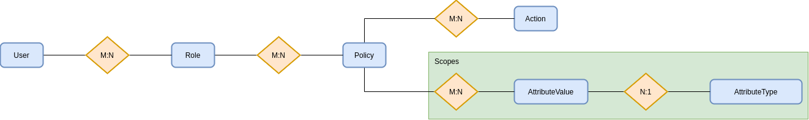
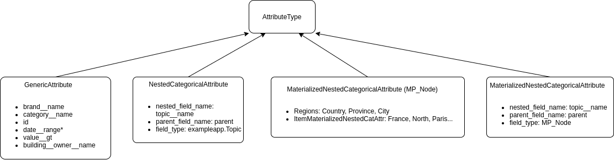

Concepts
========

Example
------------

To understand how permissions are stored into django-flex-abac, let's
suppose we have a database like the one described in the image next:

.. image:: _static/example_simple.png
  :width: 600
  :align: center
  :alt: Simple example DB

We would like to add permissions to our application.

- For instance, we would like to add read permissions to a viewer user and read/write permissions to an admin user.
- Also, we can have different viewer roles, so just some brands are reachable by certain users.

Based on this, an example of a possible set of permissions is defined in the table next:

+----------------+-----------------+-----------------+--------------------+------------------+
| **Role Name**  | Read Everything | Read Odd Brands | Write Odd Brands   | Read Even Categ. |
+================+=================+=================+====================+==================+
| **Actions**    | Can View        | Can View        | Can Edit, Can View | Can View         |
+----------------+-----------------+-----------------+--------------------+------------------+
| **Brands**     | *all*           | Just 1, 3       | Just 1, 3          | *all*            |
+----------------+-----------------+-----------------+--------------------+------------------+
| **Categories** | *all*           | *all*           | *all*              | Just 2,4         |
+----------------+-----------------+-----------------+--------------------+------------------+
| **Users**      | Peter           | John, Susan     | Mary               | Susan, Michael   |
+----------------+-----------------+-----------------+--------------------+------------------+

Overview
--------

We need a way to store these permissions in a database, so they are represented with flexibility, making it easy to
change them later. A coarse-grained schematic representation of how permissions are currently being stored is shown
in the following image:

As can be seen in that image, permissions are represented by the following elements (represented from lower to higher
nesting level).

- **Roles**: Roles are a combination of policies.

  - **Policies**: Policies define which actions can be done (actions), and for which objects (scopes).

    - **Actions**: Actions define the powers granted to the policy on objects falling inside the associated scopes.
    - **Scopes**: A scope defines a subset of objects using attributes. A scope is made up of filters.

      - **Filters**: A filter defines on or more acceptable values for an object attribute. Each filter is defined by:

        - An **attribute type**: An attribute is the representation of an attribute related to a django model. In practice
          these attributes can be anything which can be represented by a django lookup (``Generic Attribute``),
          as well as other special attribute types as represented in the :ref:`attribute_types_concepts` section below.
        - One or more **attribute values**: A filter is not complete if we do not define the specific values which will be used to
          check the access rights the user has towards the object. An attribute value defines the values an specific
          attribute type can take.

A user can be given many roles.

.. warning::

    - If the same action name is used in several policies assigned to a user through one or more roles, the applicable
      scope is the union of all the related filters.
    - At the same time, if the same attribute is applicable in several policies at once, the resulting filter for such
      attribute will be the intersection of all the values associated with the attribute.
    - If the attribute has no values associated, it means that it is allowing all the possible values.

.. _attribute_types_concepts:

Attribute types
---------------

Attributes are represented by a set of models which inherit from ``flex_abac.models.AttributeType``. The existing
attribute types are represented next:

The most basic attributes are the ``flex_abac.models.GenericAttribute`` and ``flex_abac.models.CategoricalAttribute``
models, but flex_abac.models.NestedCategoricalAttribute and flex_abac.models.MaterializedNestedCategoricalAttribute can be useful in case we need
permissions over attributes with a certain level of hierarchy.

* ``flex_abac.models.GenericAttribute``: Allows the creation of a model-related attribute of any kind. You will use it with
  almost everything that can be represented by a Django lookup, including the custom ones. Described at
  :meth:`flex_abac.models.GenericAttribute`.
* ``flex_abac.models.CategoricalAttribute``: Special case of the ``GenericAttribute`` meant for foreign keys to
  categories. Usually, the referenced foreign model will have at least a field which is the name of the category. Described at
  :meth:`flex_abac.models.CategoricalAttribute`.
* ``flex_abac.models.NestedCategoricalAttribute``: Special case of a categorical attribute in which values are nested in a tree.
  That means that if the filter is applied over a value that is in the upper levels of the tree, any value that is
  nested from that value will be also allowed by the policy. This kind of attribute corresponds to a foreign table which
  is a field that contains the name of the category, and another one indicating the parent. It is also possible to use trees
  constructed through the ``treebeard`` (https://django-treebeard.readthedocs.io/) library. Described at
  :meth:`flex_abac.models.NestedCategoricalAttribute`.
* ``flex_abac.models.MaterializedNestedCategoricalAttribute``: Special case of a nested categorical attribute, in which
  trees have a predefined structure (that is, each level in the tree corresponds at the same to a category). An example of
  this could be a location, which can be categorized as country, region, city, street, etc. Described at
  :meth:`flex_abac.models.MaterializedNestedCategoricalAttribute`.

Examples of how to use attribute types can be found in the setUp() method defined at:
https://github.com/batvoice-org/django-flex-rbac/blob/main/flex_abac/tests/views/test_permissionsview.py#L73

How the system determines if a user is allowed to access an endpoint
----------------------------------------------------------------------------

Once integrated with the library (check for instance the documentation at :doc:`usage_recipes` or :doc:`advanced_usage`),
when a user tries to access an endpoint, the following steps take place:

#. The associated action name will be gathered through the ``ActionNameGenerator`` defined by the
   ``flex_abac_action_name`` property of the associated view. If the resulting action name is not among the actions
   associated to the policies belonging to the user, then access if forbidden and the process stops.
#. If query parameters are provided, the system checks that all of them are valid by matching them against
   attribute values defined in the scopes of policies containing the action_name. This takes place inside the method
   :meth:`flex_abac.checkers.is_attribute_query_in_scope_from_mapping`. If one of the query parameters is not compliant
   with any of the filters, then a `403` Forbidden error will be returned to the user.
#. If the query parameters are correct, With the  action_name is known, the system iterates over all the policies
   associated with the user through the roles. This occurs inside the :meth:`flex_abac.checkers.can_user_do` method. If
   the action_name exists for one of the policies, then:

    - If it is not a detailed view (there is not a specific object involved), it will be enough to find a compliant policy.
    - Otherwise, we check that the provided object is compliant with the combined filters of the policies for which this action exists.

How the system determines which values can be listed
-----------------------------------------------------

Filters to be applied over objects are obtained through the method :meth:`flex_abac.checkers.get_filter_for_valid_objects`.
For the sake of clarity, let's consider in this section that a "compliant policy" is a policy containing the action we
are providing.

- Given a single compliant policy, for each attribute, the resulting filter will be the **OR** combination of the filter values in that policy.
  That is, if any of the filters is valid the policy is valid. If no filter is provided for an attribute, all possible values
  are considered as valid.
- When the same attribute exists in two or more compliant policies, the resulting filter will be the **OR** combination of
  the combined filters of these policies.
- When there are more than one attribute types in one or more compliant policies, the resulting filter will be the **AND**
  combination of the filter values for these attributes.

As a rule of thumb, although internally represented in a non-iterative way through Django ORM filters,
we can consider that filters are grouped among the entire set of compliant policies as if it was a
single policy, then we check attribute type by attribute type that at least one of the filters is valid, and check that
all attribute types have a valid filter complying with the object.
