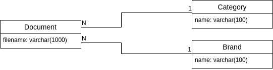

.. _getting_started:

Getting started
===============

Example
-------

To understand how permissions are stored into django-flex-abac, let's
suppose we have a database as the one described in the :doc:`concepts` section:

We want to create two roles relative to the Document model for users Peter, Mary,
John, Susan, Michael, and Anne.

+-------------+--------------------+--------------------+
|             | Role Edit          | Role View          |
+=============+====================+====================+
| **Actions** | Can Edit Documents | Can View Documents |
+-------------+--------------------+--------------------+
| **Users**   | Peter, Mary        | Mary, John         |
+-------------+--------------------+--------------------+

\* NOTE: Susan, Michael, and Anne have not been assigned to any role, so they shouldn't be able to access our data.

Data preparation
****************

Before we can continue, let's introduce some data in our test database. We can load the data contained in the provided
fixtures in the exampleapp:

.. code-block:: console

    $ python manage.py loaddata exampleapp/fixtures/exampleapp.yaml

As a result, we will have the following data available for testing:

+----+------------+----------+-------------+
| id |  filename  | brand_id | category_id |
+====+============+==========+=============+
|  1 | document1  |        1 |       1     |
+----+------------+----------+-------------+
|  2 | document2  |        1 |       2     |
+----+------------+----------+-------------+
|  3 | document3  |        1 |       3     |
+----+------------+----------+-------------+
|  4 | document4  |        2 |       1     |
+----+------------+----------+-------------+
|  5 | document5  |        2 |       1     |
+----+------------+----------+-------------+
|  6 | document6  |        2 |       2     |
+----+------------+----------+-------------+
|  7 | document7  |        2 |       2     |
+----+------------+----------+-------------+
|  8 | document8  |        3 |       3     |
+----+------------+----------+-------------+
|  9 | document9  |        3 |       1     |
+----+------------+----------+-------------+
| 10 | document10 |        3 |       1     |
+----+------------+----------+-------------+
| 11 | document11 |        2 |       2     |
+----+------------+----------+-------------+
| 12 | document12 |        3 |       3     |
+----+------------+----------+-------------+
| 13 | document13 |        3 |       3     |
+----+------------+----------+-------------+

Now we are ready to create the first permissions.

Creating your first Role-Based Access Control System
----------------------------------------------------

To assign the permissions, we will need to store the roles information in
the database. To do so, we first create the users:

.. code-block:: console

    $ python manage shell

.. code-block:: python

    from django.contrib.auth.models import User

    peter = User.objects.create_user(username="Peter")
    mary = User.objects.create_user(username="Mary")
    john = User.objects.create_user(username="John")
    susan = User.objects.create_user(username="Susan")
    michael = User.objects.create_user(username="Michael")
    anne = User.objects.create_user(username="Anne")

Now that the four users are in our database, let's store the database. Since at this point we are just creating
a Role-Based Access Control System, it will be enough to create the actions allowed in each policy.

Each of these policies will be assigned to a role (in this case each role contains a single policy, but it could
hold more).

Finally, users will be assigned to the roles.

Creating the actions
********************

The first step is the creation of the actions we want to have in our permissions system. According to the example above,
we just need to create two actions: one for edition, and another one for visualization.

By default, django-flex-abac expects action names to be in the shape ``<name_of_the_model>__<read|write>``. More complex
names and usages can be performed by following the instructions in :ref:`custom_action_names`.

So for the above example, we can do something like this:

.. code-block:: python

    from flex_abac.models import Action

    action_read = Action.objects.create(pretty_name=f"Can read documents",
                                        name=f"document__read")
    action_write = Action.objects.create(pretty_name=f"Can edit documents",
                                         name=f"document__write")

Creating the policies
*********************

At this point, the process becomes easy, just need to add the desired actions to the single policy we are creating.

.. code-block:: python

    from flex_abac.factories.policyfactory import PolicyFactory

    policy_read = PolicyFactory.create(name="Policy Read")
    policy_write = PolicyFactory.create(name="Policy Write")
    policy_read.actions.add(action_read)
    policy_write.actions.add(action_write)

Creating the roles
******************

Each policy is then attached to the related role. As said, in this case, we are not using more than one policy, but it
would be possible to add more than one, and also to reuse policies in different roles.

.. code-block:: python

    from flex_abac.factories.rolefactory import RoleFactory

    role_read = RoleFactory.create(name="Role Read")
    role_write = RoleFactory.create(name="Role Write")
    role_read.policies.add(policy_read)
    role_write.policies.add(policy_write)

Adding roles to users
*********************

Finally, we can add the roles to the corresponding users:

.. code-block:: python

    role_write.users.add(peter)
    role_write.users.add(mary)
    role_read.users.add(mary)
    role_read.users.add(john)

As stated above, Susan won't be assigned to any role.

Anonymous user
##############

Sometimes you want to provide certain access level to users which hasn't been authenticated. For instance, you have a
web shop in which you want to show your products to anyone, but buying is restricted to registered users.

In these cases you will need to define the permissions which apply to an Anonymous user. This can be done by assigning
the desired roles to the ``None`` user.

.. code-block:: python

    role_read.users.add(None)

Creating your ViewSet
*********************

Now we need a ViewSet that will allow us to test our permissions system. This is done as follows:

.. code-block:: python

    from flex_abac.permissions import CanExecuteMethodPermission

    class DocumentsViewSet(viewsets.ModelViewSet):
        permission_classes = [CanExecuteMethodPermission]
        serializer_class = DocumentSerializer
        queryset = Document.objects

And that's it! Please note that we are adding :meth:`flex_abac.permissions.CanExecuteMethodPermission` to the list of permission_classes. This will
check the information contained in the database and will decide whether or not we are allowed to access the document.

Testing your ViewSet
********************

Now we would like to check that our system is performing as expected. Let's start with Susan since she shouldn't be
allowed to access any document.

.. code-block:: python

    from rest_framework.test import APIClient

    # NOTE: This is just needed for testing purposes, do not include the following two lines
    # in your project unless you know what you are doing!
    from django.conf import settings
    settings.ALLOWED_HOSTS += ['testserver']

    django_client = APIClient(enforce_csrf_checks=False)
    django_client.force_authenticate(user=susan)
    django_client.get('/example/documents/')
    # Forbidden: /example/documents/
    # <Response status_code=403, "application/json">

    django_client.post('/example/documents/', {
            "filename": "test_filename_susan",
            "category": { "name": "test_category_susan" },
            "brand": { "name": "test_brand_susan" }
        }, format="json")
    # Forbidden: /example/documents/
    # <Response status_code=403, "application/json">

As can be observed, Susan is not allowed to list the documents, nor creating them. Let's see what happens for user John.

.. code-block:: python

    django_client.force_authenticate(user=john)
    django_client.get('/example/documents/')
    # <Response status_code=200, "application/json">

    django_client.post('/example/documents/', {
            "filename": "test_filename_john",
            "category": { "name": "test_category_john" },
            "brand": { "name": "test_brand_john" }
        }, format="json")
    # Forbidden: /example/documents/
    # <Response status_code=403, "application/json">

In this case, we observe that John is allowed to list the documents (code 200), but he is not allowed to create a
document, as expected.

Finally, let's check if Mary is allowed to do both things.

.. code-block:: python

    django_client.force_authenticate(user=mary)
    django_client.get('/example/documents/')
    # <Response status_code=200, "application/json">

    django_client.post('/example/documents/', {
            "filename": "test_filename_mary",
            "category": { "name": "test_category_mary" },
            "brand": { "name": "test_brand_mary" }
    }, format="json")
    # <Response status_code=201, "application/json">

As expected, Mary can do both things, since she belongs to both roles, getting the 200 and 201 HTTP codes for
listing and creation, respectively.

.. _creating_first_rbac:

Creating your first Attribute-Role-Based Access Control System
--------------------------------------------------------------

To apply the access control system, we will restructure our permissions as represented in the next table:

+--------------------+-----------------+-----------------+--------------------+----------------------+
| **Role Name**      | Read Everything | Read Odd Brands | Write Odd Brands   | Read Even Categories |
+====================+=================+=================+====================+======================+
| **Actions**        | Can View        | Can View        | Can Edit, Can View | Can View             |
+--------------------+-----------------+-----------------+--------------------+----------------------+
| **Brands**         | *all*           | Just 1, 3       | Just 1, 3          | *all*                |
+--------------------+-----------------+-----------------+--------------------+----------------------+
| **Categories**     | *all*           | *all*           | *all*              | Just 2,4             |
+--------------------+-----------------+-----------------+--------------------+----------------------+
| **Users**          | Peter           | John, Susan     | Mary               | Susan, Michael       |
+--------------------+-----------------+-----------------+--------------------+----------------------+

\* NOTE: Anne has not been assigned to any role, so they shouldn't be able to access our data.

Before moving on, we first detach the users from the previous roles.

.. code-block:: python

    role_write.users.remove(peter)
    role_write.users.remove(mary)
    role_read.users.remove(mary)
    role_read.users.remove(john)

We already know how to create the Roles and Policies, so we will do it directly before we start:

.. code-block:: python

    from flex_abac.factories.policyfactory import PolicyFactory
    from flex_abac.factories.rolefactory import RoleFactory

    # Policy creation
    policy_read_everything = PolicyFactory.create(name="Policy Read Everything")
    policy_read_odd_brands = PolicyFactory.create(name="Policy Read Odd Brands")
    policy_write_odd_brands = PolicyFactory.create(name="Policy Write Odd Brands")
    policy_read_even_category = PolicyFactory.create(name="Policy Read Even Categories")

    # Adding actions
    policy_read_everything.actions.add(action_read)
    policy_read_odd_brands.actions.add(action_read)
    policy_write_odd_brands.actions.add(action_read)
    policy_read_even_category.actions.add(action_read)
    policy_write_odd_brands.actions.add(action_write)   # This policy can also write

    # Roles creation
    role_read_everything = RoleFactory.create(name="Role Read Everything")
    role_read_odd_brands = RoleFactory.create(name="Role Read Odd Brands")
    role_write_odd_brands = RoleFactory.create(name="Role Write Odd Brands")
    role_read_even_category = RoleFactory.create(name="Role Read Even Categories")

    # Adding policies to roles
    role_read_everything.policies.add(policy_read_everything)
    role_read_odd_brands.policies.add(policy_read_odd_brands)
    role_write_odd_brands.policies.add(policy_write_odd_brands)
    role_read_even_category.policies.add(policy_read_even_category)

    # Finally, assigning roles to users
    role_read_everything.users.add(peter)
    role_read_odd_brands.users.add(john)
    role_read_odd_brands.users.add(susan)
    role_write_odd_brands.users.add(mary)
    role_read_even_category.users.add(susan)
    role_read_even_category.users.add(michael)

Creating the categorical attributes
***********************************

In order to work with attribute-based permissions system, we need to create a set of attributes we will want to check,
and also the filters we want to apply for each of these attributes. When combined, filters will enable permission admins
to define scopes.

In our use case, we want to control access to documents based on two attributes: the "brand" the document belongs to,
and the document's "category". These are categorical attributes which can take a finite list of values.

Hence, we define two categorical attributes which will filter over the category and brand foreign keys of the documents.
We can create them as follows:

.. code-block:: python

    from flex_abac.factories.categoricalattributefactory import ModelCategoricalAttributeFactory
    from exampleapp.models import Document

    brand_attribute = ModelCategoricalAttributeFactory.create(
                        attribute_type__name="Brand attribute",
                        attribute_type__field_name="brand_id",
                        content_object=Document)
    brand_attribute = brand_attribute.attribute_type

    category_attribute = ModelCategoricalAttributeFactory.create(
                        attribute_type__name="Category attribute",
                        attribute_type__field_name="category_id",
                        content_object=Document)
    category_attribute = category_attribute.attribute_type

In this example, we only rely on categorical attributes, but note that we can also create other types of attributes
using django lookups. For instance, you might want to give access only to documents created within a period.
Examples of lookups:

* ``category__name``
* ``library__book__chapter__name``
* ``document__size__gt``
* ``registry_date__range``
* Custom lookups (see https://docs.djangoproject.com/en/3.2/howto/custom-lookups/)
* etc.

Defining possible values for the categorical attributes
*******************************************************

For each attribute, we need to set the possible values that it can take. This can be done as follows:

.. code-block:: python

    from flex_abac.factories.categoricalfilterfactory import CategoricalFilterFactory

    brand_filters = [ CategoricalFilterFactory.create(attribute_type=brand_attribute, value=value)
                    for value in range(0, 5) ]
    category_filters = [ CategoricalFilterFactory.create(attribute_type=category_attribute, value=value)
                        for value in range(0, 5) ]

Adding filters to policies
**************************

Now we have the filters, we can add these to one or more policies. Based on the table above, we apply these as follows:

.. code-block:: python

    from flex_abac.factories.policycategoricalfilterfactory import PolicyCategoricalFilterFactory

    PolicyCategoricalFilterFactory.create(value=brand_filters[1], policy=policy_read_odd_brands)
    PolicyCategoricalFilterFactory.create(value=brand_filters[3], policy=policy_read_odd_brands)
    PolicyCategoricalFilterFactory.create(value=brand_filters[1], policy=policy_write_odd_brands)
    PolicyCategoricalFilterFactory.create(value=brand_filters[3], policy=policy_write_odd_brands)
    PolicyCategoricalFilterFactory.create(value=category_filters[2], policy=policy_read_even_category)
    PolicyCategoricalFilterFactory.create(value=category_filters[4], policy=policy_read_even_category)

If no filter is applied to a policy, that means that the user will have full access to all the objects. The only restriction
in that case will come from the actions associated to each endpoint.

Adding access control to Django REST Framework filtering
********************************************************

When filtering objects, we want the permissions system to check that the filters will only yield
objects that the user is allowed to access.

In order to also consider the scope while filtering, we will need to add the :meth:`flex_abac.mixins.ApplyFilterMixin`.

.. code-block:: python

    from flex_abac.mixins import ApplyFilterMixin
    from flex_abac.permissions import CanExecuteMethodPermission

    class DocumentsViewSet(ApplyFilterMixin, viewsets.ModelViewSet):
        permission_classes = [CanExecuteMethodPermission]
        serializer_class = DocumentSerializer
        queryset = Document.objects

Now, let's test that our system works as expected. We can start with Peter, who should be able to access
any document. For instance, let's show the identifiers of the brands he can access:

.. code-block:: python

    django_client.force_authenticate(user=peter)

    response = django_client.get('/example/documents/')
    print(response.status_code, [(item["brand"]["pk"], item["category"]["pk"])
                                    for item in response.data])
    # 200 [(1, 1), (1, 2), (1, 3), (2, 1), (2, 1), (2, 2), (2, 2), (3, 3), (3, 1),
    #      (3, 1), (2, 2), (3, 3), (3, 3)]

As we can see, he can access all brand identifiers, both odd and even. Same for categories.

If we switch to Michael, we should be able to just see the odd brands and even categories.

.. code-block:: python

    django_client.force_authenticate(user=michael)

    response = django_client.get('/example/documents/')
    print(response.status_code, [(item["brand"]["pk"], item["category"]["pk"])
                                    for item in response.data])
    # 200 [(1, 2), (2, 2), (2, 2), (2, 2)]

Susan belongs to both roles "Read Odd Brands" and "Read Even Categories", so it will belong to **ANY** of these categories.

For negative filtering, you can use any of the additional :ref:`lookups`, or create a custom one.

.. code-block:: python

    django_client.force_authenticate(user=susan)

    response = django_client.get('/example/documents/')
    print(response.status_code, [(item["brand"]["pk"], item["category"]["pk"])
                                    for item in response.data])
    # 200 [(1, 1), (1, 2), (1, 3), (2, 2), (2, 2), (3, 3), (3, 1), (3, 1), (2, 2), (3, 3), (3, 3)]

Let's focus now on John. For instance, if we want to see the detail for a specific even brand, it should give us a
403 error. But he should be able to access an odd brand.

.. code-block:: python

    # Brand id for "document4" is 2, Brand id for "document1" is 1
    django_client.force_authenticate(user=peter)
    django_client.get('/example/documents/4/')
    # <Response status_code=200, "application/json">

    django_client.force_authenticate(user=john)
    django_client.get('/example/documents/4/')
    # Not Found: /example/documents/4/
    # <Response status_code=404, "application/json">
    django_client.get('/example/documents/1/')
    # <Response status_code=200, "application/json">

Is John allowed to modify document1 (He shouldn't)? Is Mary allowed (She should)?

.. code-block:: python

    django_client.force_authenticate(user=john)
    django_client.put('/example/documents/1/',
                {
                    "filename": "filename_new",
                    "category": { "name": "category_new" },
                    "brand": { "name": "brand_new" }
                }, format="json")
    # <Response status_code=403, "application/json">

    django_client.force_authenticate(user=mary)
    django_client.put('/example/documents/1/',
                {
                    "filename": "filename_new",
                    "category": { "name": "category_new" },
                    "brand": { "name": "brand_new" }
                }, format="json")
    # <Response status_code=200, "application/json">

Finally, we can use the filters on an endpoint call so the provided attributes can be used as user-provided filters
to be more specific on queries. We can use John as an example of this.

.. code-block:: python

    django_client.force_authenticate(user=john)

    response = django_client.get('/example/documents/')
    print(response.status_code, [item["brand"]["pk"] for item in response.data])
    # 200 [1, 1, 3, 3, 3, 3, 3, 1]

    response = django_client.get('/example/documents/?brand_id=1')
    print(response.status_code, [item["brand"]["pk"] for item in response.data])
    # 200 [1, 1, 1]

    response = django_client.get('/example/documents/?brand_id=2')
    # Forbidden: /example/documents/

    response = django_client.get('/example/documents/?brand_id=1&brand_id=3')
    print(response.status_code, [item["brand"]["pk"] for item in response.data])
    # 200 [1, 1, 3, 3, 3, 3, 3, 1]

We can combine different attributes. For instance, for Susan:

.. code-block:: python

    django_client.force_authenticate(user=susan)

    response = django_client.get('/example/documents/?brand_id=1&category_id=2')
    print(response.status_code, [(item["brand"]["pk"], item["category"]["pk"])
                                    for item in response.data])
    # 200 [(1, 2)]

Importing attributes from yaml
******************************

Attributes can be added to the database and configured directly using python, but this can be time-consuming and
error-prone.

Using the import_attributes management command, you can easily document and configure your attributes through
a yaml file. Example:

.. code-block:: yaml

    types:
      CategoricalAttribute:
        - name: "Category attribute"
          field_name: "category__id"
          class_name: "exampleapp.document"
          values:
            - value: 1
            - value: 2
            - value: 3
        - name: "Brand attribute"
          field_name: "brand__id"
          class_name: "exampleapp.document"
          values:
            - value: 1
            - value: 2
            - value: 3

Using this yaml file as input, it is possible to automatically create the attributes and the associated values. This
works for :meth:`flex_abac.models.CategoricalAttribute`, but also for other attribute types, like
:meth:`flex_abac.models.GenericAttribute`, :meth:`flex_abac.models.NestedCategoricalAttribute` or
:meth:`flex_abac.models.MaterializedNestedCategoricalAttribute`. More information about
this can be obtained in the :meth:`flex_abac.utils.import_attributes.import_from_yaml` section.

Then, it is as simple as using the provided command:

.. code-block:: console

    $ python manage.py import_attributes --yaml-path </path/to/yaml_file.yaml>

What's next?
------------

You can check how to integrate the permissions in your application by checking the documentation at :doc:`usage_recipes`,
or you can check how permissions can be managed directly from the provided :doc:`rest_api` by following the guide
:doc:`getting_started_with_rest_api`.
